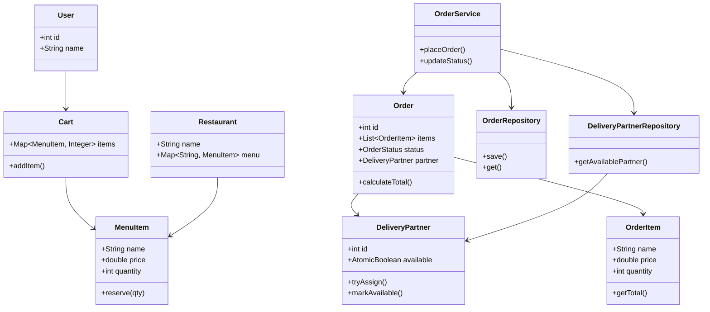

# 🍔 Food Ordering System (Swiggy/Zomato Style)


---

## ✨ Overview

A **scalable, thread-safe food ordering system** built in Java, inspired by real-world platforms like Swiggy and Zomato.

This project demonstrates strong **Low-Level Design (LLD)** skills, handling:

* Concurrency
* Inventory consistency
* Order lifecycle
* Clean architecture

---

## 🚀 Features

* 🍽️ Restaurant menu with inventory management
* 🛒 Cart-based ordering
* 📦 Order creation with immutable snapshot (`OrderItem`)
* 🚚 Delivery partner assignment (lock-free)
* ⚡ Thread-safe inventory reservation (no overselling)
* 🔢 Atomic ID generation
* 🧵 Multi-threaded simulation (real-world concurrency)
* 🧠 Strategy Pattern for pricing

---

## 🏗️ System Architecture

```
Main (Driver)
   ↓
OrderService (Business Logic)
   ↓
Repositories (Data Layer)
   ↓
Models (Entities)
```

---

## 🧩 Core Components

### 🔹 Models

* `User`
* `MenuItem` (thread-safe inventory)
* `OrderItem` (immutable snapshot)
* `Order`
* `DeliveryPartner`

---

### 🔹 Repository Layer

* `OrderRepository` → thread-safe order storage
* `DeliveryPartnerRepository` → partner management & assignment

---

### 🔹 Service Layer

* `OrderService`

  * Handles order placement
  * Inventory reservation
  * Delivery assignment
  * Status updates

---

## 🔒 Concurrency Design

| Component           | Approach                        |
| ------------------- | ------------------------------- |
| Inventory           | `ReentrantLock` per MenuItem    |
| Delivery Assignment | `AtomicBoolean.compareAndSet()` |
| Order Storage       | `ConcurrentHashMap`             |
| ID Generation       | `AtomicInteger`                 |

---

## 🧠 Design Patterns Used

### ✅ Strategy Pattern

* Used for pricing calculation
* Easily extendable (discounts, surge pricing)

---

## 🔥 Key Design Decisions

* **OrderItem snapshot**
  → prevents cart mutation affecting past orders

* **Lock per MenuItem**
  → avoids overselling in concurrent orders

* **AtomicBoolean for delivery assignment**
  → lock-free, high-performance

* **Repository abstraction**
  → separates data access from business logic

---

## 🧪 Concurrency Testing

Simulated using `ExecutorService` with multiple threads.

Each thread:

1. Creates a cart
2. Places an order
3. Competes for inventory and delivery partners

### Expected Behavior:

* No overselling of items ✅
* No duplicate partner assignment ✅
* Some orders may fail if resources unavailable ✅

---

## 📊 Sample Output

```
Order 1 placed. Total: 400.0
Order 2 placed. Total: 400.0
Failed: Out of stock: Pizza
Failed: No delivery partner available
```

---

## ⚠️ Edge Cases Handled

* Out of stock items
* Concurrent ordering collisions
* No delivery partner available
* Immutable order state

---

## 🔮 Future Enhancements

* ⏳ Order cancellation + refund
* 📍 Location-based delivery assignment
* 🧠 State Pattern for order lifecycle
* 🌐 REST APIs (Spring Boot)
* 🗄️ Database integration
* 📊 Monitoring & logging

---

## ▶️ How to Run

### Compile

```
javac Main.java
```

### Run

```
java Main
```

---

## 🎯 Interview Takeaways

This project demonstrates:

* Strong **Low-Level Design (LLD)**
* Real-world **concurrency handling**
* Practical use of **design patterns**
* Ability to handle **race conditions and scaling concerns**

---

## 👩‍💻 Author

Built as part of backend/SDE machine coding preparation.

---

## 🧩 Low-Level Design (LLD)



